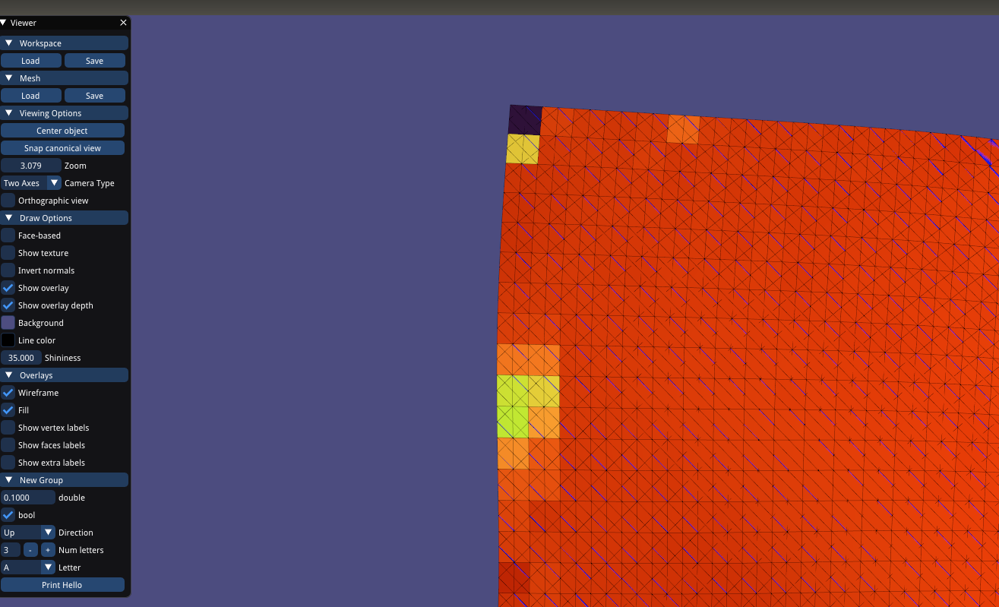
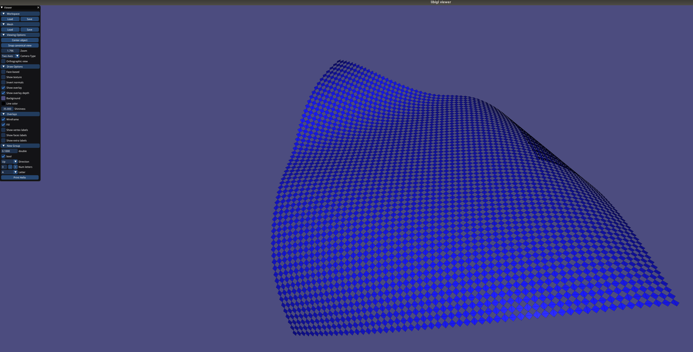
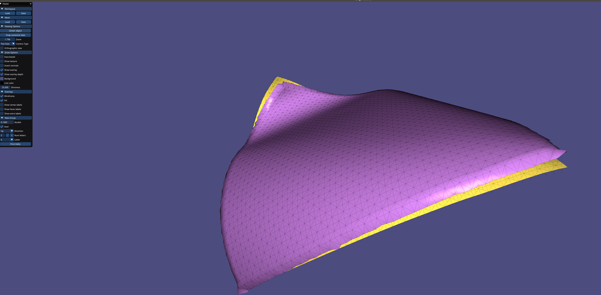

# Isometric Deformation and Killing Field

## Instructions
This is the solution to my course project

 

 
## Getting OpenMesh
All Documentation, binaries and original source code are available at www.openmesh.org  

The main git repository is available at:  
https://www.graphics.rwth-aachen.de:9000/OpenMesh/OpenMesh.git  

The gitlab site can be found here:  
https://www.graphics.rwth-aachen.de:9000/OpenMesh/OpenMesh  

The python bindings can be found here:    
https://www.graphics.rwth-aachen.de:9000/OpenMesh/openmesh-python

## Download Sources
[ Download Sources](https://www.graphics.rwth-aachen.de:9000/OpenMesh/OpenMesh/-/jobs/artifacts/master/browse/?job=Sources )

## Installing
Unpack the tar-ball to a suitable place.  

A detailed build manual for Mac/Windows/Linux is in the Documentation   
located at Doc/html/index.html   

## Documentation

The latest Documentation can be found at:  
http://www.openmesh.org/media/Documentations/OpenMesh-Doc-Latest  

Documentation for previous versions is available on our website as well.  
